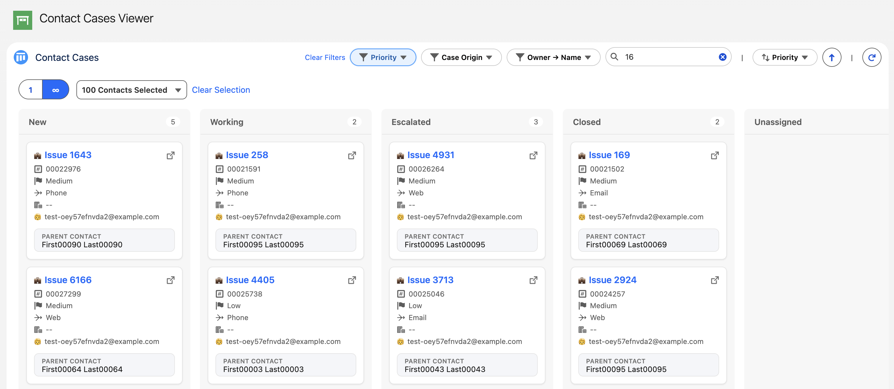
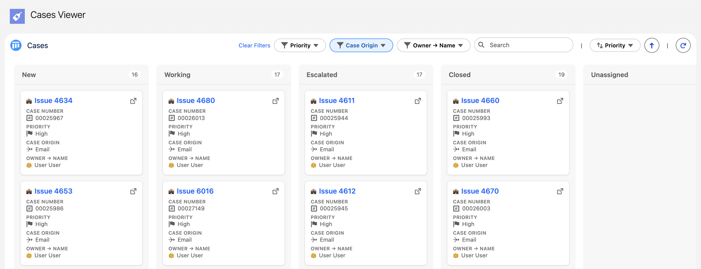
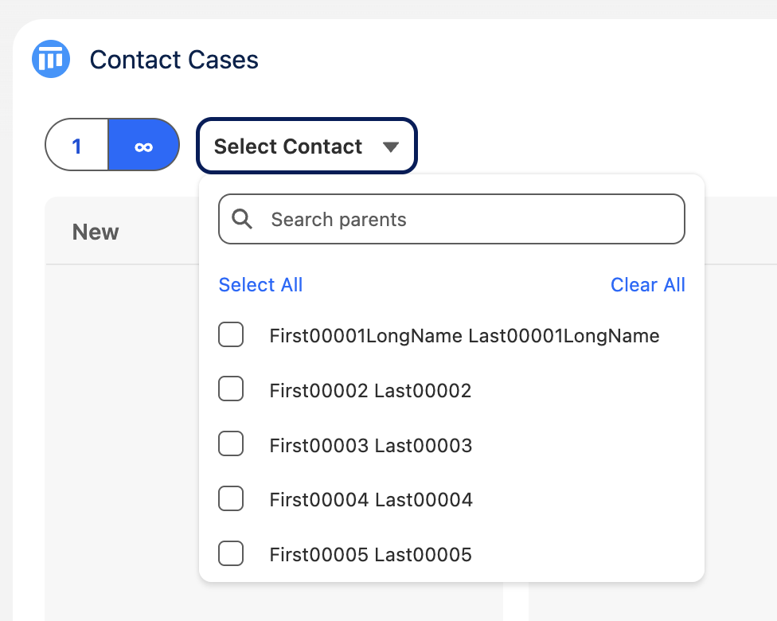

# Lightning Record Explorer Suite

A suite (of just one so far 😉) lightning web components for Salesforce.

# Kanban Explorer

The powerful kanban board component for Salesforce that brings true kanban functionality to your org.

## What is Kanban Explorer?

Kanban Explorer is a Lightning Web Component that transforms your Salesforce records into interactive kanban boards.

🚀 **Key Features**

- **Dynamic kanban boards** - drag-and-drop functionality
- **Context-aware operation** - works on record pages, app pages, and home pages
- **Multiple data modes** - parent mode (single select and multi select), parentless mode, and record page mode
- **Rich customization** - configurable fields, filters, search, and sorting
- **Visual enhancements** - icons, emojis, and custom card layouts
- **Real-time updates** - record changes sync instantly with Salesforce

## Quick Start

1. **Install the latest package** from the [releases page](https://github.com/lemerv/Lightning-Record-Explorer-Suite/releases)
2. **Add LRES Kanban Explorer** to your Lightning page using the App Builder
3. **Configure basic properties** (card object, grouping field, and card fields)
4. **Save and activate** your page to start using your kanban board!

## Documentation Guide

### 🔧 For Salesforce Admins

- **[Admin Guide](/docs/admin-guide.md)** - Complete installation, configuration, and setup instructions

## Typical Use Cases

Kanban Explorer adapts to various business processes:

- **Service** - Case management by status, priority, or team
- **Sales** - Opportunity pipeline tracking through sales stages
- **Project Management** - Task tracking by status, assignee, or milestone
- **Custom Objects** - Any Salesforce object with a picklist/text field for grouping

## Key Features Overview

### 📊 Board Views

- **Parent-Child Mode**: View related records for a specific parent (e.g., Cases for an Account)
- **Parentless Mode**: View all records of an object (e.g., all Cases across the org)
- **Multi-Parent Selection**: Aggregate records from multiple parents simultaneously

### 🎛️ Configuration Options

- **Custom Grouping**: Group by picklist or text fields (Status, Stage, Priority, etc.)
- **Card Customization**: Choose which fields display on cards with custom icons and formatting
- **Advanced Filtering**: Multi-select filters, search functionality, and custom sorting
- **SOQL Control**: Precise control over which records appear with custom WHERE and ORDER BY clauses

### 🔄 Interactive Features

- **Drag & Drop**: Move cards between columns to update record values
- **Record Editing**: Click cards to open modal windows for quick record viewing and editing
- **Real-time Updates**: Changes sync immediately with Salesforce
- **Parent Selection**: Switch between different parent records or select multiple parents to view thier child records

### 🎨 Visual Customization

- **Field Icons**: Use SLDS icons or emojis to enhance card readability
- **Date Formatting**: Custom date/time display formats
- **Field Labels**: Toggle field labels on/off for cleaner interfaces
- **Card Counts**: Display record counts per column

### 🔒 Safe and Secure

1. **Field Level Security**: Component respects Salesforce field-level security
2. **Record Access**: Respects record sharing and visibility
3. **Object Security**: Users need appropriate object permissions
4. **SOQL Security**: WITH SECURITY_ENFORCED automatically applied and optional clauses are sanitised

## Getting Help

If you encounter issues, have questions, find a bug, or want to request a feature, please log an Issue.

## Installation Requirements

- **Salesforce Platform**: Compatible with Lightning Experience
- **Permissions**: Standard user permissions sufficient for basic usage

---

**Ready to get started?** Begin with the [Admin Guide](/docs/admin-guide.md) for setup instructions.
